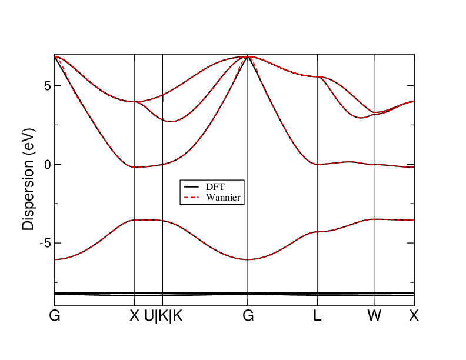
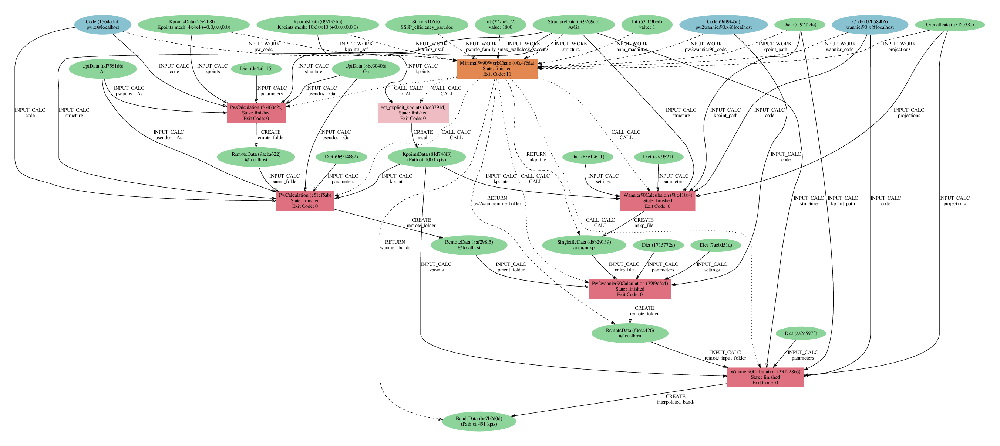

# GaAs wannierization workchain

This AiiDA workchain runs a full workflow from scratch (i.e., both Quantum ESPRESSO and Wannier90) to wannierise a GaAs crystal using manually-specified projections.
The workflow returns the parsed information from the standard Wannier90 output (i.e. centres, spreads, etc.) and the interpolated band structure.

We use in the following the `verdi` command-line interface (CLI). 

A reminder of a few useful AiiDA commands:
1. `verdi process list -a -p <N>` (to monitor the state of the calculations done in the last `<N>` days)
1. `verdi process show <identifier>` (to list inputs and outputs of a calculation, especially useful after the calculation is finished) 

## Run your simulation

Open a terminal and enter the virtual environment where AiiDA is installed.

Then, enter the `examples/workflows` folder of the `aiida-wannier90` plugin and run the following script to launch a new workflow:
```    
./launch_w90_minimal.py -h
``` 
This will show the help of the command. You need to specify three required parameters: a `quantumespresso.pw` code, a `quantumespresso.pw2wannier90` code and a `wannier90.wannier90` code (that you need to setup before).
An example full command looks like:
```
./launch_w90_minimal.py -s pw@computer -p pw2wannier90@computer -w wannier90@computer
```

This will launch the simple workchain that is provided with `aiida-wannier90`, whose class name is `MinimalW90WorkChain`and that is found in the python module `aiida_wannier90.workflows.minimal`.

*Note*: in this example we use sp3 orbitals centred on As atoms as starting guesses for projections. For more 
details about the inputs of QE and Wannier90 calculations you can inspect both the launcher and the workchain itself.

## Check the results

When you run the `launch_w90_minimal.py`, on screen you will get an output line for each step running (i.e. in order: `pw.x` SCF, `pw.x` NSCF, `wannier90.x` preprocessing, `pw2wannier.x`, main `wannier90.x` run), reporting the identifier (PK) of each calculation. You can inspect each calculation node by typing, for instance:
``` 
verdi process show <PK>
```
to see the inputs and outputs of each calculation, or
``` 
verdi data dict show <PK>
``` 
to inspect the contect of `Dict` nodes, such as the `output_parameters` of the Wannier90 calculation, containing the parsed information from the output of the code.

As final results you get all the information parsed in AiiDA and saved as outputs, as [documented online](https://aiida-wannier90.readthedocs.io/en/latest/index.html).

### Band structure

Once the calculation is finished, you export or visualize the resulting bands interpolated using maximally-localised Wannier functions (MLWFs).
First, find the PK of the `BandStructure` returned by the workflow using the command:
```
verdi node show <PK>
```
(passing the workflow PK). The `BandStructure` PK is found by looking for the output node with link label `wannier_bands`.

With this `BandStructure` PK, you can show the bands with xmgrace using:
```
verdi data bands show -F agr <PK> 
```
or export it to file using:
```
verdi data bands export -F agr <PK> -o interpolated.agr
```
where `interpolated.agr` is the output file name where the band structure will be stored.

### Compare with DFT bands

You can compare the interpolated band structure with the bands obtained directly from DFT (Quantum ESPRESSO).
You can compute this band structure, but for convenience 
we provide the `DFT-bands.agr` file in the same folder.
After having exported the MLWF-interpolated bands as explained above, you can plot together both of them, executing the following command:
```
xmgrace DFT-bands.agr interpolated.agr 
```

You should see something like the following plot (where we just changed some graphical aspects):



## Visualizing AiiDA provenance graphs

As you might have noticed in the sections above, data provenance is tracked automatically and stored in the form of a directed acyclic graph.  
Each  calculation is represented by a node, that is linked to its input and output data nodes.
The provenance graph can visualised graphically using the following command:
```
verdi node graph generate <PK>
```   
where you can use the PK of a node for which you want to see the provenance (for instance a calculation, or the final band structure).

This command, by default, generates a PDF file named `<PK>.dot.pdf`, that you can view with your favourite software.



